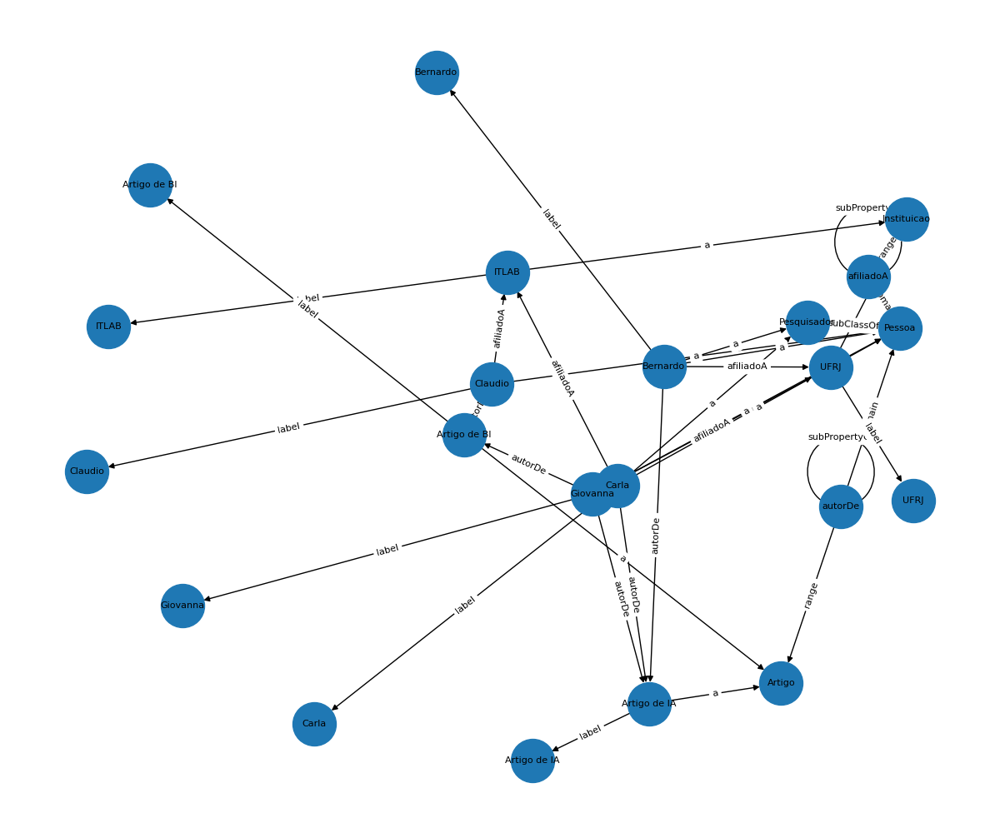

# Ontologia + SPARQL
Exemplo de construção de uma ontologia simples, como popular um grafo RDF, serializar em Turtle e rodar consultas SPARQL em Python usando [`rdflib`]. Inclui opções de visualização (NetworkX/Matplotlib, PyVis) e inferência (owlrl).

> Conceitos-modelo: `Pessoa`, `Pesquisador` (subclasse de Pessoa), `Artigo`, `Instituicao` 
> Propriedades: `autorDe` (Pessoa→Artigo), `afiliadoA` (Pessoa→Instituicao)

### Modelo de Ontologia

**Classes**

- `ex:Pessoa`, `ex:Artigo`, `ex:Instituicao`

- `ex:Pesquisador rdfs:subClassOf ex:Pessoa`

**Propriedades de objeto**

- `ex:autorDe (domain: Pessoa, range: Artigo)`

- `ex:afiliadoA (domain: Pessoa, range: Instituicao)`

**Indivíduos (exemplos)**

- Pessoas: `ex:Bernardo`, `ex:Giovanna`, `ex:Claudio`, `ex:Carla`

- Artigos: `ex:ArtigoIA`, `ex:ArtigoBI`

- Instituições: `ex:UFRJ`, `ex:ITLAB`

### Representação do Grafo RDF

